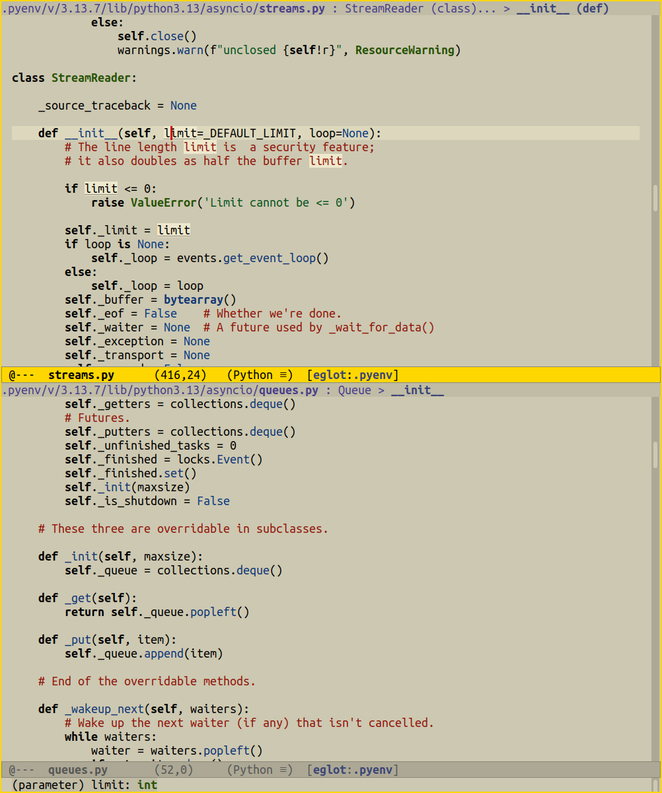

# Emacs Faff Theme

A light theme with a soothing warm-neutral background, built on the [modus-themes](https://github.com/protesilaos/modus-themes) framework.

The cornsilk3 background was chosen with high-end off-white notepaper in mind to avoid the glare of many light themes.  The relatively dark background also allows the use of brighter backgrounds for selections and highlighting.

Features:
- Systematic color palette with WCAG AA contrast ratios
- Palette overrides via `faff-palette-overrides`
- Boxed magit refs, diff headers, and org agenda headers for clarity
- Gold active mode line
- Adopts refinements from `ef-themes-palette-common` for subtler links,
  cleaner search highlighting, and simpler marks/completions (see the
  clearly marked block in the source to revert to stock modus defaults)
- Works with `modus-themes-bold-constructs`, `modus-themes-variable-pitch-ui`,
  and other modus-themes options



(Screenshot shows `modus-themes-bold-constructs` set, per the author's preference, using the beautiful Ubuntu Mono)

## Installation


``` elisp
;; available from melpa
(use-package faff-theme)
;; or github
(use-package faff-theme
      :vc (:url "https://github.com/WJCFerguson/emacs-faff-theme.git"))
;; then load
(load-theme 'faff t)
```

## Variables are not highlighted

By design, `variable` and `variable-use` map to `fg-main`, so variables
appear as plain text

To add variable highlighting, use palette overrides before loading the theme:

``` elisp
(setq faff-palette-overrides
      '((variable red-faint)
        (variable-use cyan-faint)))
```

## Former non-modus version

The former ad-hoc theme, without dependencies, is available as `faff-legacy` theme, or from the repo at versions <4.0.  

## Suggestions and bug reports

Suggestions and bug reports are gratefully received.  If you find something odd or unclear please submit issues or make pull requests.  `C-u C-x =` tells you what faces are under the cursor.

